<!-- =========================== HERO =========================== -->


<p align="center">
  <a href="https://git.io/typing-svg">
    
  </a>
</p>

<p align="center">
  <a href="https://github.com/Shashank4231">
    
  </a>
  
</p>

<br/>

<!-- =========================== NAVIGATION =========================== -->

<p align="center">
  <a href="#-about-me">About</a> •
  <a href="#-tech-stack">Tech Stack</a> •
  <a href="#-featured-projects">Projects</a> •
  <a href="#-github-analytics">Analytics</a> •
  <a href="#-current-focus">Current Focus</a> •
  <a href="#-connect-with-me">Connect</a>
</p>

---

<!-- =========================== ABOUT =========================== -->

## 👨‍💻 About Me

```javascript
const shashank = {
  role: "Computer Engineering Student & Full Stack Developer",

  currentlyLearning: [
    "Spring Boot",
    "Backend Architecture",
    "System Design"
  ],

  interests: [
    "Full Stack Development",
    "Scalable Applications",
    "Problem Solving"
  ],

  philosophy:
    "Learn continuously. Build consistently. Improve every day."
};
```

* 🎓 Computer Engineering student passionate about software development.
* 💻 Focused on building modern **full-stack applications**.
* 🧠 Continuously improving my **DSA and problem-solving skills**.
* 🚀 Interested in creating scalable and production-ready applications.
* 🌱 Currently exploring **Spring Boot, backend development, and system design**.
* ⚡ I enjoy turning ideas into real, working products.

---

<!-- =========================== CONNECT =========================== -->

## 🤝 Connect With Me

<p align="center">

<a href="https://www.linkedin.com/in/shashank-shekhar-b7b66128a/">
  
</a>

<a href="https://github.com/Shashank4231">
  
</a>

<a href="https://leetcode.com/u/Shashank4231/">
  
</a>

</p>

---

<!-- =========================== TECH STACK =========================== -->

## ⚡ Tech Stack

### 💻 Languages

<p align="left">
  
</p>

### 🎨 Frontend Development

<p align="left">
  
</p>

### ⚙️ Backend Development

<p align="left">
  
</p>

### 🗄️ Databases

<p align="left">
  
</p>

### 🛠️ Tools & Platforms

<p align="left">
  
</p>

---

<!-- =========================== PROJECTS =========================== -->

## 🚀 Featured Projects

<table>
<tr>

<td width="50%" valign="top">

<h3 align="center">💻 CodeSync</h3>

<p align="center">
A full-stack collaborative technical interview platform built for real-time coding and communication.
</p>

### ✨ Highlights

* ⚡ Real-time collaborative code synchronization
* 🧑‍💻 Interactive coding environment
* 🎥 Video and audio communication
* 🔌 WebSocket-powered real-time features
* 🧠 AI-powered technical feedback
* 🏗️ Modern full-stack architecture

### 🛠️ Built With

<p>


</p>

<p align="center">

<a href="https://github.com/Shashank4231/codesync-interview-platform">
  
</a>

</p>

</td>

<td width="50%" valign="top">

<h3 align="center">🛒 SmartShop AI</h3>

<p align="center">
An AI-powered full-stack e-commerce platform designed to create a smarter and more personalized shopping experience.
</p>

### ✨ Highlights

* 🛍️ Modern e-commerce experience
* 🤖 AI-powered shopping features
* 🔐 User authentication
* 🛒 Product and shopping workflows
* 📱 Responsive user interface
* ⚡ Full-stack application architecture

### 🛠️ Built With

<p>


</p>

<p align="center">

<a href="https://github.com/Shashank4231/SmartShop-AI">
  
</a>

</p>

</td>

</tr>
</table>

---

<!-- =========================== GITHUB ANALYTICS =========================== -->

## 📊 GitHub Analytics

<p align="center">



</p> <p align="center">


</p>

---

<!-- =========================== ACTIVITY GRAPH =========================== -->

## 📈 Contribution Activity

<p align="center">
  
</p>

---

<!-- =========================== CURRENT FOCUS =========================== -->

## 🎯 Current Focus

```text
📚 Data Structures & Algorithms

⚙️ Backend Development

🌱 Spring Boot

🏗️ System Design Fundamentals

🚀 Building Production-Ready Projects
```

---

<!-- =========================== LEARNING =========================== -->

## 🌱 Learning Journey

<p align="center">

```text
Frontend
   ↓
React & Modern JavaScript
   ↓
Full Stack Development
   ↓
Backend Engineering
   ↓
Spring Boot
   ↓
System Design
   ↓
Scalable Applications 🚀
```

</p>

---

<!-- =========================== PRINCIPLE =========================== -->

## 🧠 Developer Mindset

> **Learn → Build → Break → Debug → Improve → Repeat**

<p align="center">
  <i>Consistency compounds into expertise.</i>
</p>

---

<!-- =========================== SNAKE =========================== -->

## 🐍 Contribution Snake

<p align="center">
  
</p>

---

<!-- =========================== FOOTER =========================== -->

<p align="center">

### ⭐ Thanks for visiting my profile!

**Feel free to explore my repositories, connect with me, and follow my journey.**

</p>


